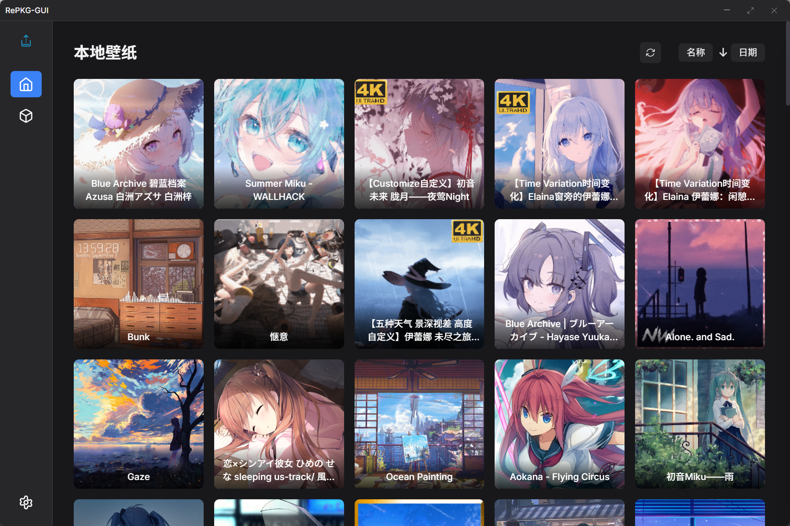

# RePKG-GUI

<div align="center">

  

  **基于 Tauri 的现代化 RePKG 图形界面工具**

  [](./LICENSE)
  [](https://tauri.app/)
  [](https://www.rust-lang.org/)

  [English](./README_en.md) | [中文](./README.md)
</div>

## 👀 预览

*现代化界面设计，支持亮色/暗色主题*




## 🌟 功能特性

### 核心功能
- **智能解包**：支持批量提取 `.pkg` 文件，自动处理文件结构
- **本地壁纸管理**：自动扫描并展示 Steam 创意工坊壁纸
- **手动解包**：支持拖拽或选择文件进行手动解包
- **预览功能**：显示壁纸缩略图和详细信息

### 用户体验
- **现代化界面**：采用 Tailwind CSS 设计的响应式界面
- **主题切换**：支持亮色/暗色/跟随系统主题
- **自定义路径**：可自定义 Steam 创意工坊路径和提取目录
- **批量操作**：支持批量解包和文件管理

## 🚀 快速开始

### 环境要求
- **Rust**: 最新稳定版
- **Node.js**: 18.0 或更高版本
- **pnpm**: 包管理器 (推荐)

### 安装依赖

```bash
# 安装前端依赖
pnpm install

# 安装 Rust 依赖
cd src-tauri
cargo build --release
```

### 开发模式运行

```bash
# 同时启动前端和后端开发服务器
pnpm tauri dev
```

### 构建生产版本

```bash
# 构建生产版本
pnpm tauri build

# 构建结果将在 src-tauri/target/release/bundle/ 目录下
```

## 📁 项目结构

```
repkg-gui/
├── src/                    # 前端代码
│   ├── index.html         # 主页面
│   ├── css/styles.css     # 样式文件
│   └── js/                # JavaScript 模块
├── src-tauri/             # Tauri 后端
│   ├── src/
│   │   ├── main.rs        # 入口文件
│   │   ├── lib.rs         # 主要功能实现
│   │   └── repkg.rs       # RePKG 核心功能
│   ├── Cargo.toml         # Rust 依赖配置
│   └── tauri.conf.json    # Tauri 配置
├── bin/                   # RePKG 可执行文件
└── README.md
```

## 🛠️ 技术栈

### 前端
- **HTML5** + **CSS3** + **JavaScript (ES6+)**
- **Tailwind CSS** - 实用优先的 CSS 框架
- **原生 DOM API** - 无框架依赖，轻量高效

### 后端
- **Tauri 2.0** - 构建跨平台桌面应用
- **Rust** - 系统级编程语言
- **Tokio** - 异步运行时

### 核心依赖
- **RePKG** - 壁纸引擎 `.pkg` 文件解包工具

## 🙏 致谢

- [RePKG](https://github.com/NotAdam/RePKG) - 核心解包工具
- [Tauri](https://tauri.app/) - 跨平台桌面应用框架
- [Tailwind CSS](https://tailwindcss.com/) - CSS 框架
- [Steam Workshop](https://steamcommunity.com/workshop/) - 壁纸资源平台

## 📄 许可证

本项目采用 MIT 许可证。
