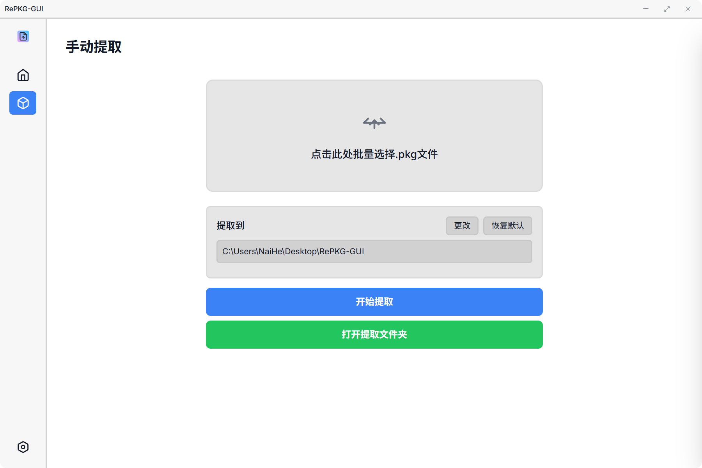
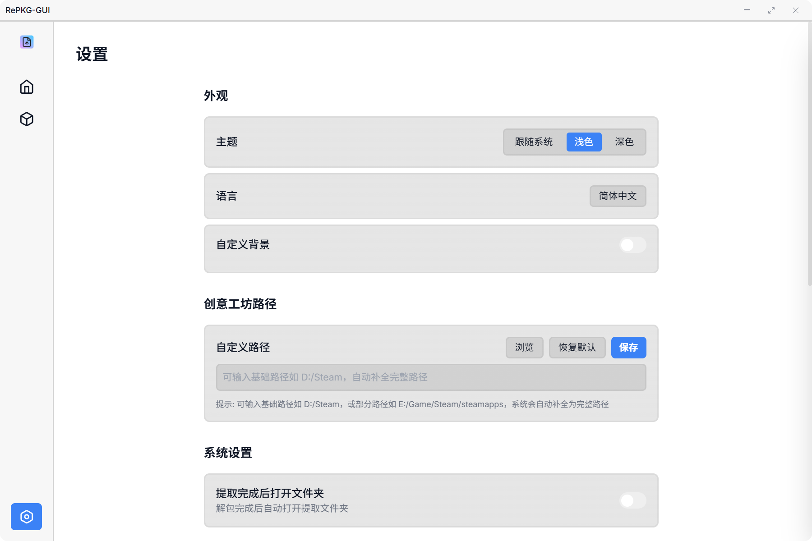
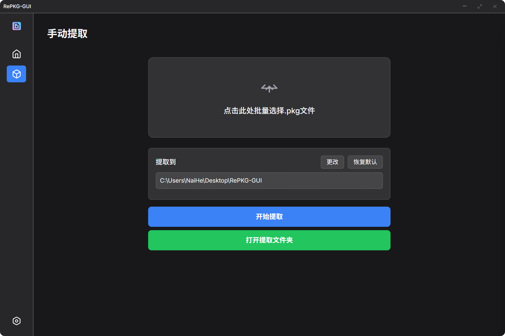
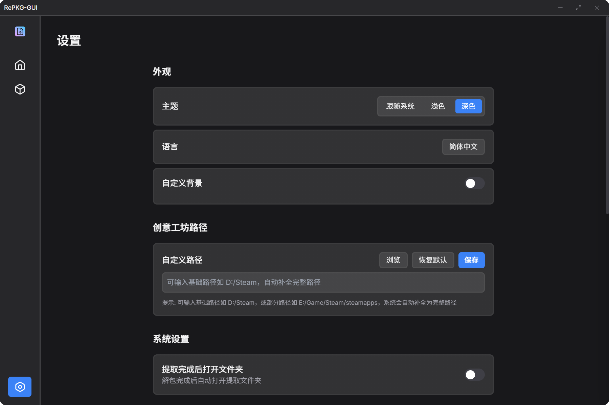
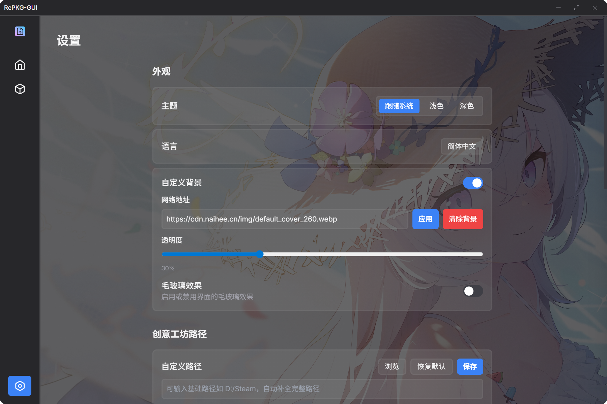

# RePKG-GUI

<div align="center">

  

  **基于 Tauri 的现代化 RePKG 图形界面工具**

  [](./LICENSE)
  [](https://tauri.app/)
  [](https://www.rust-lang.org/)

  [English](./README_en.md) | [中文](./README.md)

</div>

## 👀 预览

*现代化界面设计，支持亮色/暗色主题，支持自定义背景*

<details>

<summary>亮色主题</summary>

### **首页**


### **手动提取**



### **设置**


</details>

<details>

<summary>暗色主题</summary>

### **首页**


### **手动提取**



### **设置**



</details>

<details>
<summary>自定义背景</summary>



</details>


## 🌟 功能特性

### 核心功能
- **解包pkg**：支持批量提取 `.pkg` 文件，自动处理文件结构
- **本地壁纸管理**：自动扫描并展示 Steam 创意工坊壁纸
- **导入壁纸编辑器**：导入后可以直接在Wallpaper Engine中编辑壁纸
- **手动解包**：支持选择pkg文件进行手动解包
- **预览功能**：显示壁纸缩略图和详细信息

### 用户体验
- **现代化界面**：采用 Tailwind CSS 设计的响应式界面
- **主题切换**：支持亮色/暗色/跟随系统主题
- **语言切换**：支持英文/中文语言切换
- **自定义背景**：支持设置网络图片URL作为应用背景，可调节透明度
- **自定义路径**：可自定义 Steam 创意工坊路径和提取目录
- **批量操作**：支持批量解包

## ⚙️ 配置

### 应用程序设置

*首次启动 RePKG GUI，自动在程序根目录生成`settings.json`*

```json
{
  "language": "zh-CN",
  "glass-effect": false,
  "auto-open-extract-folder": false,
  "auto-open-import-folder": false,
  "create-folder-per-wallpaper": false,
  "only-images": false,
  "no-tex-convert": false,
  "ignore-dir-structure": false,
  "overwrite-files": false,
  "extract-path": "C:\\Users\\xxx\\Desktop\\RePKG-GUI",
  "extract-path-manual": "C:\\Users\\xxx\\Desktop\\RePKG-GUI",
  "workshop-path": "",
  "theme": "system",
  "custom-background": {
    "enabled": false,
    "url": "https://example.com/img.webp",
    "type": "image",
    "opacity": 0.3
  }
}
```


## 🚀 快速开始

### 环境要求
- **Rust**: 最新稳定版
- **Node.js**：v22+ 和 pnpm
- **Git**：版本控制

### 步骤

```bash
# 克隆仓库
git clone https://github.com/NaiHeeeee/repkg-gui.git
cd repkg-gui

# 安装 Node.js 依赖
pnpm install

# 启动开发服务器
pnpm tauri dev
```

### 使用RePKG GUI开发命令管理器快速开始

```bash
cd repkg-gui
pnpm run cmd
```

```
╔══════════════════════════════════════╗
║       RePKG GUI 开发命令管理器       ║
╚══════════════════════════════════════╝
当前版本: vx.x.x

可用命令:

  1  开发模式      启动开发服务器                 [pnpm run tauri dev]
  2  构建应用      使用版本管理构建应用           [pnpm run tauri:build:version]
  3  快速构建      直接构建应用(跳过版本管理)     [pnpm run tauri:build]
  4  版本管理      管理项目版本号                 [pnpm run version:manage]
  5  Cargo检查     检查src-tauri的代码语法        [cargo check]
  6  Cargo清理     清理src-tauri的构建缓存        [cargo clean]
  7  清理控制台    注释console                    [pnpm run remove-console]
  8  检查未用i18n  查找未使用的国际化文本         [pnpm run find-unused-i18n]
  0  退出          退出命令管理器

请选择要执行的命令 (输入序号):
```

## 📁 项目结构

```
repkg-gui/
├── .gitattributes               # Git 属性配置文件
├── .gitignore                   # Git 忽略文件配置
├── LICENSE                      # MIT 许可证文件
├── README.md                    # 中文说明文档
├── README_en.md                 # 英文说明文档
├── assets/                      # 项目资源文件
├── package.json                 # Node.js 项目配置文件
├── scripts/                     # 构建脚本
├── src/                         # 前端代码
│   ├── assets/                  # 前端资源文件
│   ├── css/                     # 样式文件
│   ├── i18n/                    # 国际化配置
│   │   └── locales/             # 语言包目录
│   ├── index.html               # 主页面文件
│   └── js/                      # JavaScript 文件
├── src-tauri/                   # Tauri 后端
│   ├── .gitignore               # Rust 项目忽略文件配置
│   ├── Cargo.toml               # Rust 项目配置文件
│   ├── build.rs                 # 构建脚本
│   ├── capabilities/            # Tauri 能力配置
│   ├── gen/                     # Tauri 生成文件
│   ├── icons/                   # 应用图标
│   ├── src/                     # Rust 源代码
│   ├── bin/                     # 可执行文件
│   │   └── RePKG.exe            # RePKG 可执行文件
│   └── tauri.conf.json          # Tauri 配置文件
```

## 🙏 致谢

- [RePKG](https://github.com/notscuffed/repkg) - 核心解包工具
- [Tauri](https://tauri.app/) - 跨平台桌面应用框架
- [Tailwind CSS](https://tailwindcss.com/) - CSS 框架
- [Steam Workshop](https://steamcommunity.com/workshop/) - 壁纸资源平台

## 📄 许可证

本项目采用 MIT 许可证。
