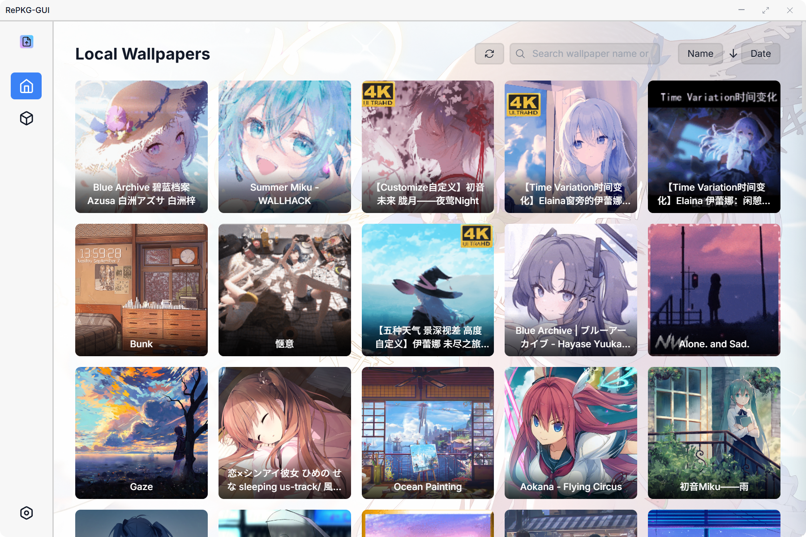
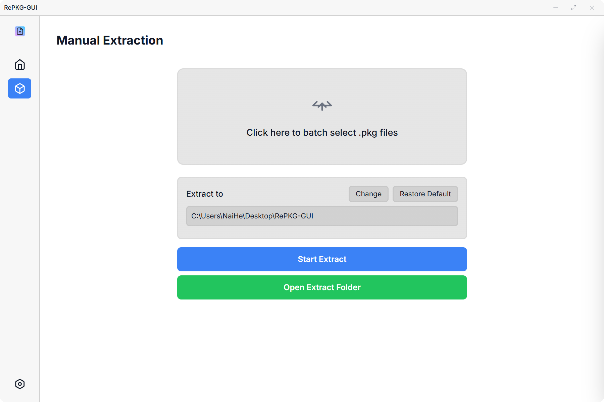
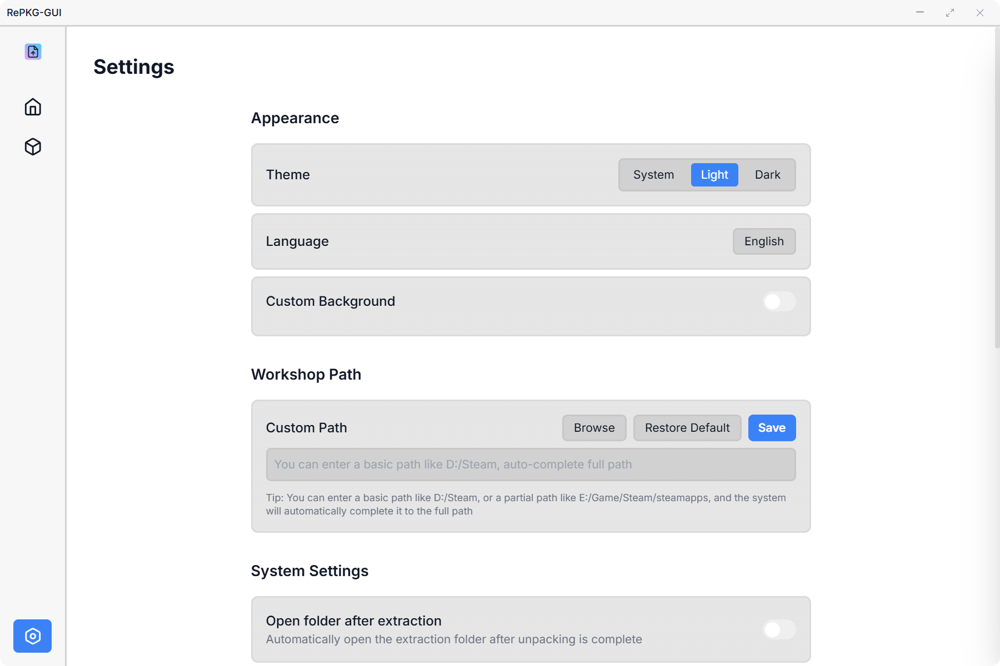
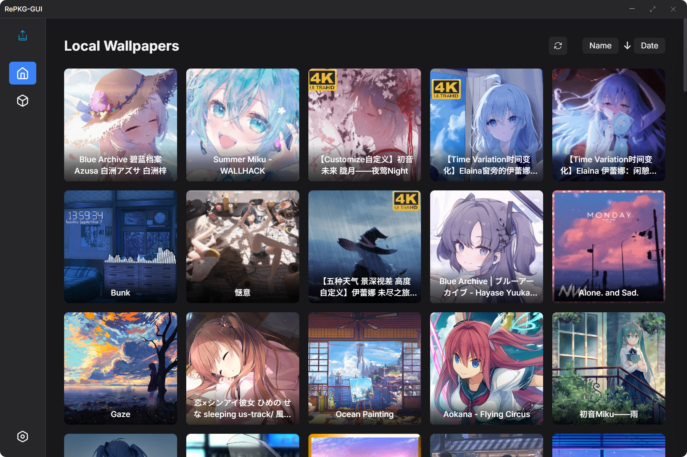
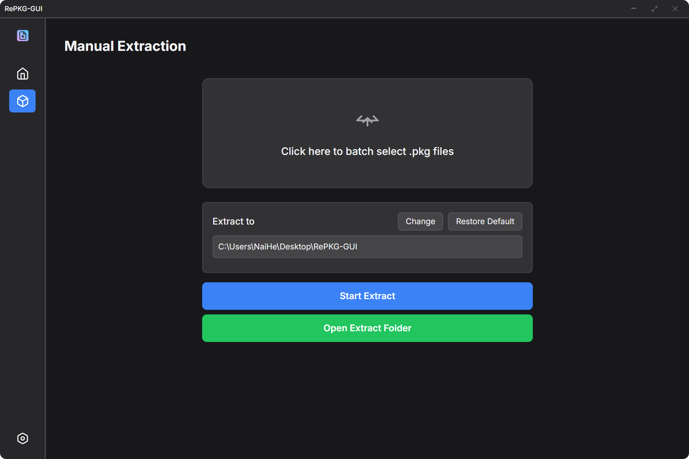
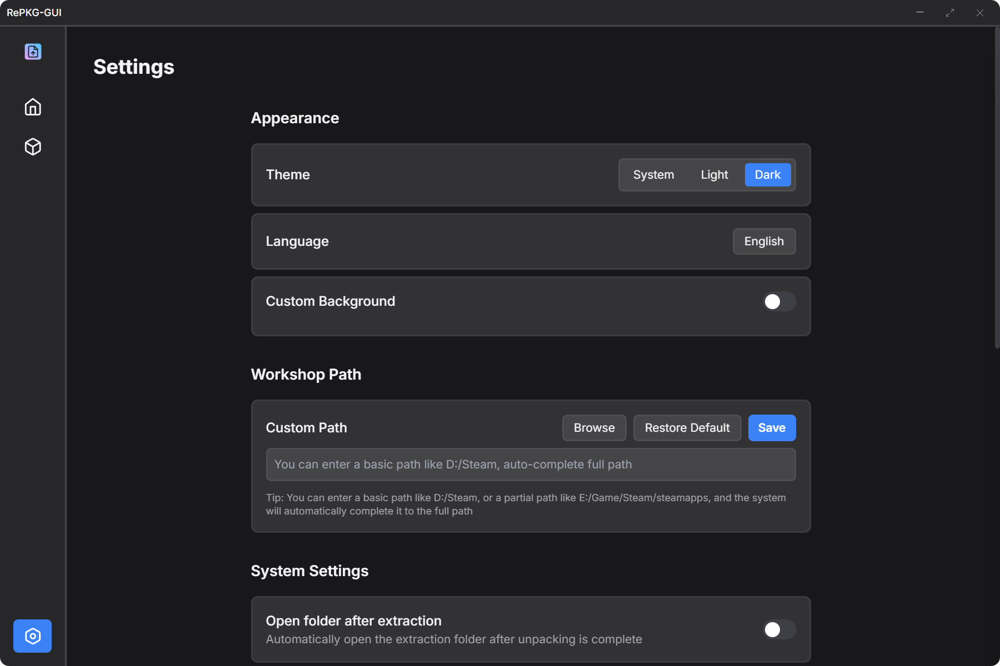
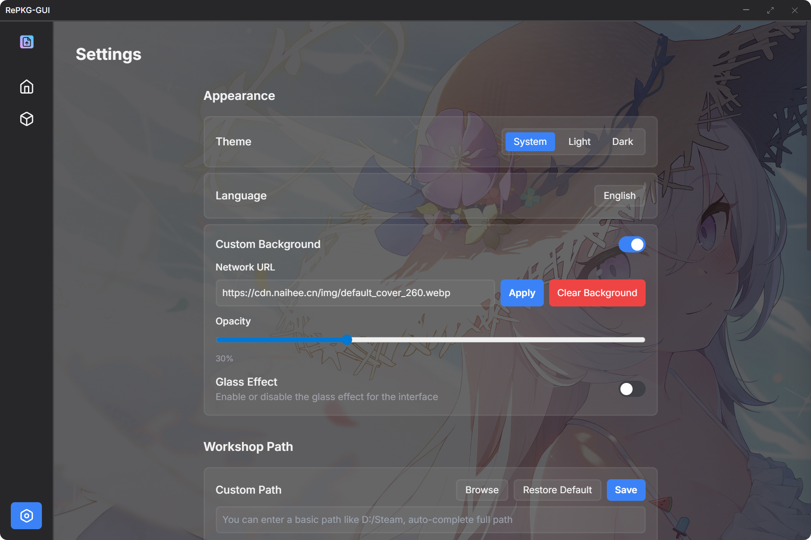

# RePKG-GUI

<div align="center">

  

  **Modern RePKG GUI tool built with Tauri**

  [](./LICENSE)
  [](https://tauri.app/)
  [](https://www.rust-lang.org/)

  [English](./README_en.md) | [中文](./README.md)
</div>

## 👀 Preview

*Modern interface design, supports light/dark themes, and custom backgrounds*

<details>

<summary>Light Theme</summary>

### **Home**



### **Manual Extract**



### **Settings**


</details>

<details>

<summary>Dark Theme</summary>

### **Home**



### **Manual Extract**



### **Settings**



</details>

<details>
<summary>Custom Background</summary>



</details>

## 🌟 Features

### Core Features
- **Unpacking pkg**: Batch extract `.pkg` files and automatically handle file structure
- **Local Wallpaper Management**: Automatically scan and display Steam Workshop wallpapers
- **Import to Wallpaper Editor**: Import directly into Wallpaper Engine for editing
- **Manual Unpacking**: Support selecting pkg files for manual unpacking
- **Preview Function**: Display wallpaper thumbnails and detailed information

### User Experience
- **Modern Interface**: Responsive interface designed with Tailwind CSS
- **Theme Switching**: Supports light/dark/system themes
- **Language Switching**: Supports English/Chinese
- **Custom Background**: Set a network image URL as the app background with adjustable opacity
- **Custom Paths**: Customize Steam Workshop path and extraction directory
- **Batch Operations**: Supports batch unpacking

## ⚙️ Configuration

### Application Settings

*On the first launch of RePKG GUI, `settings.json` is automatically generated in the program's root directory.*

```json
{
  "language": "en-US",
  "glass-effect": false,
  "auto-open-extract-folder": false,
  "auto-open-import-folder": false,
  "create-folder-per-wallpaper": false,
  "only-images": false,
  "no-tex-convert": false,
  "ignore-dir-structure": false,
  "overwrite-files": false,
  "extract-path": "C:\\Users\\xxx\\Desktop\\RePKG-GUI",
  "extract-path-manual": "C:\\Users\\xxx\\Desktop\\RePKG-GUI",
  "workshop-path": "",
  "theme": "system",
  "custom-background": {
    "enabled": false,
    "url": "https://example.com/img.webp",
    "type": "image",
    "opacity": 0.3
  }
}
```

## 🚀 Quick Start

### Environment Requirements
- **Rust**: Latest stable version
- **Node.js**: v22+ and pnpm
- **Git**: Version control

### Steps

```bash
# Clone the repository
git clone https://github.com/NaiHeeeee/repkg-gui.git
cd repkg-gui

# Install Node.js dependencies
pnpm install

# Start the development server
pnpm tauri dev
```

### Using RePKG GUI Development Command Manager

```bash
cd repkg-gui
pnpm run cmd
```

```
╔══════════════════════════════════════╗
║    RePKG GUI Development Command Manager     ║
╚══════════════════════════════════════╝
Current Version: vx.x.x

Available Commands:

  1  Development Mode   Start the development server         [pnpm run tauri dev]
  2  Build App          Build the app with version management  [pnpm run tauri:build:version]
  3  Quick Build        Build the app directly (skip version management) [pnpm run tauri:build]
  4  Version Manager    Manage the project version number        [pnpm run version:manage]
  5  Cargo Check        Check the code syntax of src-tauri   [cargo check]
  6  Cargo Clean        Clean the build cache of src-tauri   [cargo clean]
  7  Clean Console      Comment out console statements       [pnpm run remove-console]
  8  Find Unused i18n   Find unused internationalization text [pnpm run find-unused-i18n]
  0  Exit               Exit the command manager

Please select the command to execute (enter the number):
```

## 📁 Project Structure

```
repkg-gui/
├── .gitattributes               # Git attributes configuration file
├── .gitignore                   # Git ignore file configuration
├── LICENSE                      # MIT license file
├── README.md                    # Chinese documentation
├── README_en.md                 # English documentation
├── assets/                      # Project resource files
├── package.json                 # Node.js project configuration file
├── scripts/                     # Build scripts
├── src/                         # Frontend code
│   ├── assets/                  # Frontend resource files
│   ├── css/                     # Style files
│   │   └── styles.css           # Main style file
│   ├── i18n/                    # Internationalization configuration
│   │   ├── i18n.js              # Internationalization main file
│   │   └── locales/             # Language pack directory
│   ├── index.html               # Main page file
│   └── js/                      # JavaScript files
│       ├── background.js        # Background script
│       ├── main.js              # Main script
│       ├── settings.js          # Settings script
│       ├── tailwindcss.js       # Tailwind CSS script
│       └── wallpaper-editor.js  # Wallpaper editor script
├── src-tauri/                   # Tauri backend
│   ├── .gitignore               # Rust project ignore file configuration
│   ├── Cargo.toml               # Rust project configuration file
│   ├── build.rs                 # Build script
│   ├── capabilities/            # Tauri capabilities configuration
│   ├── gen/                     # Tauri generated files
│   ├── icons/                   # Application icons
│   ├── src/                     # Rust source code
│   │   ├── lib.rs               # Library file
│   │   ├── main.rs              # Main entry file
│   │   ├── repkg.rs             # RePKG related functionality
│   │   └── wallpaper_editor.rs  # Wallpaper editor functionality
│   ├── bin/                     # Executable files
│   │   └── RePKG.exe            # RePKG executable file
│   └── tauri.conf.json          # Tauri configuration file
```

## 🙏 Acknowledgments

- [RePKG](https://github.com/notscuffed/repkg) - Core unpacking tool
- [Tauri](https://tauri.app/) - Cross-platform desktop app framework
- [Tailwind CSS](https://tailwindcss.com/) - CSS framework
- [Steam Workshop](https://steamcommunity.com/workshop/) - Wallpaper resource platform

## 📄 License

This project is licensed under the MIT License.